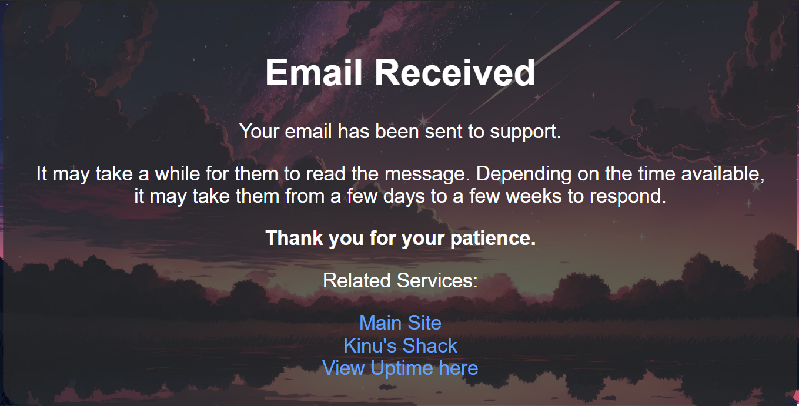
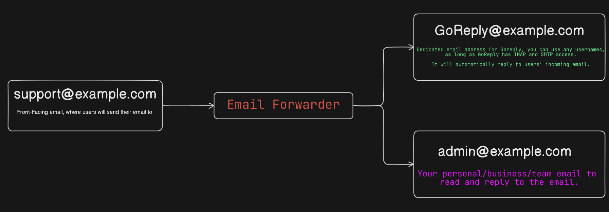

# GoReply
GoReply is an easily deployable email autoreply

# Setup
* Install requirements:
    * pip install -r requirements.txt

* Setup Config:
    * Rename `config.example.ini` to `config.ini`
    * Edit `config.ini` according to your email configuration.

# Production Readiness

The program has been tested to run continously without any errors, but to ensure it automatically restarts in a scenario there is an unexpected and unavoidable error, be sure to deploy it using `PM2` or `systemctl`/`systemd` set to restart every time it closes unexpectedly.

Ensure the program has its own dedicated email account as it will automatically delete all email it receives to reduce load and save storage. Make sure that your receiving email (The email address the users will send to) forwards it to 2 email addresses. One email will be sent to your account for you to read and the 2nd one will be sent to GoReply's dedicated account to reply to the sender. 

